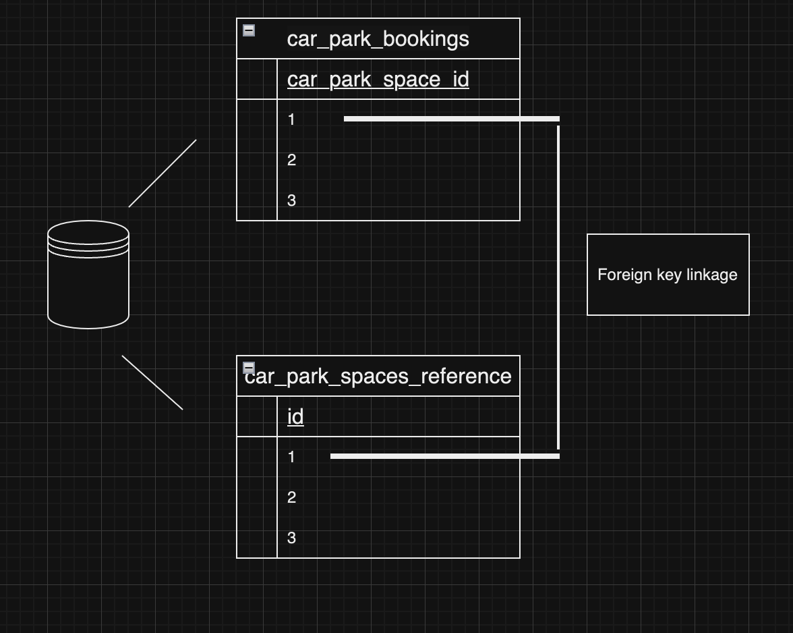

# Cavu Test Submission

This is my submission for the Cavu tech test it has been written in php using the Laravel framework with the local development and testing database environments using MySQL.

Feature and unit tests are written using the Pest framework.

My solution takes into the following problem statement:

**There is a car park at the Manchester Airport.**
**The car park has 10 spaces available so only 10 cars can be parked at the same time. Customers
should be able to park a car for a given period (i.e. 10 days).**

and the following acceptance criteria:

-   Customers should be able to check if there’s an available car parking space for a given
    date range.
-   Customer should be able to check parking price for the given dates (i.e., Weekday/Weekend Pricing, Summer/Winter Pricing)
-   Customers should be able to create a booking for given dates (from - to)
-   Customers should be able to cancel their booking.
-   Customers should be able to amend their booking.

and the following constraints:

-   Number of available spaces
-   API should show how many spaces for given date is available (per day)
-   Parking date from - date to when car is being dropped off at the car park.
-   Parking date from - date to when car will be picked up from the car park.

## Installation and requirements

Before using the app please ensure you have the latest version of php, composer, Laravel installer, Pest and MySQL all installed before running the app.

[PHP Installation guide](https://www.php.net/manual/en/install.php)

[Composer Installation guide](https://getcomposer.org/download/)

[Laravel Installation guide](https://laravel.com/docs/11.x/installation)

[Pest Installation guide](https://pestphp.com/docs/installation)

[Windows MySQL Installation guide ](https://dev.mysql.com/downloads/installer/)

To install MySQL on mac use brew for ease of use installation and the following command:

`brew install mysql`

To use the API endpoints install an API testing tool like Postman or Insomnia

[Postman Installation guide](https://www.postman.com/downloads/)

[Insomnia Installation guide](https://docs.insomnia.rest/insomnia/install)

Also to help visualise and make interacting with the app's database easier I would recommend using a database UI tool like [DBeaver](https://dbeaver.io/).

Also be aware that the PHPstan linter has been used throughout the app - I have set up a pre-push hook to run while writing the app to ensure code quality and adherence to PSR-1 standards throughout.
PHPstan includes larastan a static analysis tool to find bugs as php is not a complied language and also weakly typed.

## Usage

All commands in Laravel use artisan - Laravel's built in CLI tool.

To run the laravel app - will run on localhost:8000

`php artisan serve`

To run the tests use

`php artisan test`

Also before using any API endpoints spin up MySQL using

On Windows

[Follow the instructions here](https://dev.mysql.com/doc/mysql-getting-started/en/)

On Mac

`brew services start mysql`

Also ensure database table migrations have been run to create the relevant tables

`php artisan migrate`

and the relevant database table is seeded

`php artisan db:seed --class=CarParkSpacesSeeder`

## Using Endpoints

Check car park spaces available endpoint

`POST /check-car-park-availability`

Example req payload:

```
{
    "start_date": "2024-12-20",
    "end_date": "2024-12-25"
}
```

Calculate car parking price for given dates

`POST /check-car-park-price`

Example req payload:

```
{
    "start_date": "2024-12-20",
    "end_date": "2024-12-25"
}
```

Car park booking endpoint

`POST /book-car-park-space'`

Example req payload:

```
{
    "car_park_space_id": "1",
    "start_date": "2024-12-20",
    "end_date": "2024-12-25"
}

```

Update car park booking endpoint

`PATCH /update-car-park-booking`

Example req payload:

```
{
    "car_park_space_id": "1",
    "start_date": "2024-12-22",
    "end_date": "2024-12-27"
}
```

Cancel Car park booking endpoint

`DELETE /cancel-car-park-booking`

Example req payload

```
{
    "car_park_space_id": "1"
}
```

## Summary of Solution

To limit the car park to 10 available spaces I used one database table for bookings linked to another table which holds the number of car park spaces (rows) via a foriegn key and acts as a reference table, this ensures if any attempt at booking a car park space with an id of greater than 10 is made it will be prevented.

The reference table utilises a database trigger so that no more than 10 rows can be added.
I utilised a database trigger as this is more secure than having this logic in the app codebase and aligns the business rules with the database schema and decouples these rules from the app thereby adhering to clean architecture principles.



## Potential Improvements

List out available spaces:
Potential to have is_booked column with boolean value and any with false can be counted as available - this could be added to the `check-car-park-availability` endpoint response.

Decoupling of database logic:
To further decouple business logic between layers current ORM model logic could be moved from controllers to their own classes and then just invoked in controllers as needed this ensures controllers are not aware of code running in a lower level component in another layer as per clean architecture principles.
